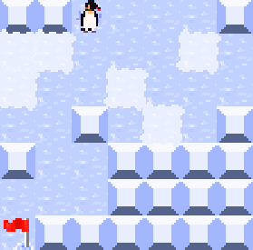
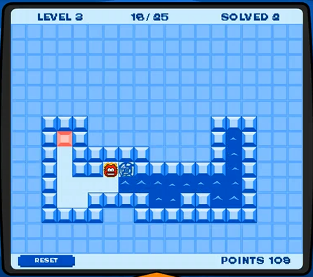

# Thin Ice Clone

A clone and extended version of the Club Penguin game "Thin Ice" using Java and Swing. Play as a penguin and traverse all ice blocks exactly once or twice, depending on block thickness. Levels are randomly generated from a config, often enabling multiple solutions. 

## Demo



## Original Thin Ice



Gameplay video: [YouTube](https://youtu.be/H8I29P8eiio)

## Features

- Configurable levels:
  - Number of single-step blocks, double-step blocks, and walls
  - Level width and height
- Random level generation from config
- Singleplayer and multiplayer (local or LAN)
- Multiple solutions possible per level
- Configurable key controls
- Undo and redo moves, and reset level

## Controls

- Default: **W, A, S, D** to move the player
- Configurable via GUI

## Requirements

- Java 21
- Gradle (for building)

## Build and Run

```bash
./gradlew run
```

## Credits

Originally developed in 2023 by Jonathan Skantz and Elias Hollstrand in the course "Project in Introduction to Computer Science" (DD1349) at KTH. Extended further by Jonathan.

